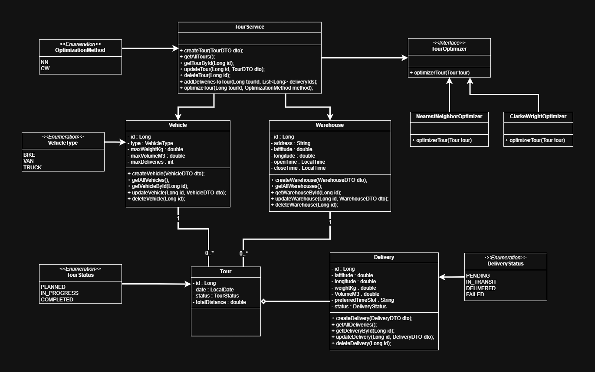
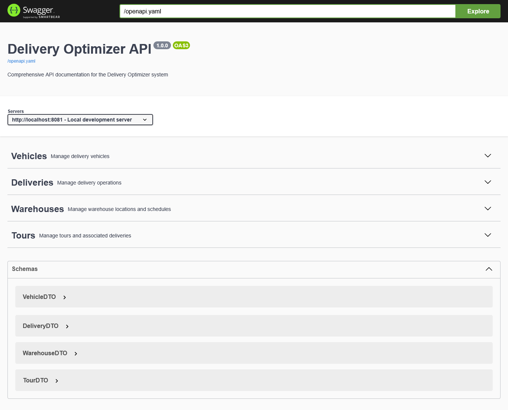

# 🚚 Delivery Tour Optimization System

## 📌 Project Description

This project is a **Spring Boot web application** developed in **Java 8+** that manages and optimizes delivery tours for a logistics company.
The system aims to reduce travel distance and fuel consumption by comparing two algorithms:
**Nearest Neighbor (NN)** and **Clarke & Wright (CW)**.

The application provides complete **CRUD operations** for managing warehouses, vehicles, and deliveries,
and automatically generates optimized delivery tours while respecting vehicle constraints.

### 🎯 Main Objectives

* Manage a **heterogeneous fleet** (Bike, Van, Truck) with their capacity constraints
* Plan and **optimize delivery tours** automatically
* **Compare** results between Nearest Neighbor and Clarke & Wright algorithms
* Calculate total distance using **GPS coordinates (latitude/longitude)**
* Provide a **REST API** tested through Postman
* Respect software design patterns and dependency injection via `applicationContext.xml` only (no annotations)

---

## 🔗 Useful Links

* 📂 [GitHub Repository](https://github.com/Ibrahim-Nidam/Delivery_Optimizer.git)
* 📝 [Jira Board](https://ibrahimnidam-22.atlassian.net/jira/software/projects/DO/boards/167?atlOrigin=eyJpIjoiNWUwYjhkMzBlMTMxNDUzOWI5N2NmMzE4YjM4OGM5NjMiLCJwIjoiaiJ9)

---

## 🛠️ Technologies Used

* **Java 8+**
* **Spring Boot**
* **Spring Data JPA** with **H2 Database**
* **Manual Dependency Injection** via `applicationContext.xml`
* **REST API** (GET, POST, PUT, DELETE)
* **Swagger** for API documentation
* **Stream API & Collections API**
* **Lombok** for boilerplate reduction
* **JUnit 5** for unit testing
* **SLF4J / java.util.logging** for logging
* **Spring Boot DevTools** for hot reload
* **SonarLint** for code quality
* **Git & Jira** for project management

---

## 📂 Project Structure

```
delivery-optimizer/
│
├── pom.xml                              # Maven configuration (dependencies, plugins)
├── .env                                 # ⚙️ enviorement variables
├── README.md                            # Documentation
├── .gitignore                           # Ignore target/, .idea/, logs, etc.
│
├── src/
│   ├── main/
│   │   ├── java/
│   │   │   └── com/deliveryoptimizer/
│   │   │       │
│   │   │       ├── DeliveryOptimizerApplication.java
│   │   │       ├── ServletInitializer.java              
│   │   │       ├── model/               # 📦 Entities + Enums
│   │   │       │   ├── Warehouse.java
│   │   │       │   ├── Vehicle.java
│   │   │       │   ├── Delivery.java
│   │   │       │   ├── Tour.java
│   │   │       │   └── enums/
│   │   │       │       ├── VehicleType.java
│   │   │       │       ├── DeliveryStatus.java
│   │   │       │       └── TourStatus.java
│   │   │       │
│   │   │       ├── dto/                 # 💬 Data Transfer Objects
│   │   │       │   ├── DeliveryDTO.java
│   │   │       │   ├── TourDTO.java
│   │   │       │   ├── WarehouseDTO.java
│   │   │       │   └── VehicleDTO.java
│   │   │       │
│   │   │       ├── mapper/              # 🧭 Mappers (Entity ↔ DTO)
│   │   │       │   ├── DeliveryMapper.java
│   │   │       │   ├── TourMapper.java
│   │   │       │   ├── WarehouseMapper.java
│   │   │       │   └── VehicleMapper.java
│   │   │       │
│   │   │       ├── repository/          # 🗄️ Data Access Layer
│   │   │       │   ├── WarehouseRepository.java
│   │   │       │   ├── VehicleRepository.java
│   │   │       │   ├── DeliveryRepository.java
│   │   │       │   └── TourRepository.java
│   │   │       │
│   │   │       ├── service/             # 💼 Business Layer
│   │   │       │   ├── interfaces/
│   │   │       │   │   ├── TourOptimizer.java
│   │   │       │   │   ├── TourService.java
│   │   │       │   │   ├── VehicleService.java
│   │   │       │   │   ├── DeliveryService.java
│   │   │       │   │   └── WarehouseService.java
│   │   │       │   │
│   │   │       │   └── impl/
│   │   │       │       ├── NearestNeighborOptimizer.java
│   │   │       │       ├── ClarkeWrightOptimizer.java
│   │   │       │       ├── TourServiceImpl.java
│   │   │       │       ├── VehicleServiceImpl.java
│   │   │       │       ├── DeliveryServiceImpl.java
│   │   │       │       └── WarehouseServiceImpl.java
│   │   │       │
│   │   │       ├── controller/          # 🎮 REST API Controllers
│   │   │       │   ├── DeliveryController.java
│   │   │       │   ├── VehicleController.java
│   │   │       │   ├── TourController.java
│   │   │       │   └── WarehouseController.java
│   │   │       │
│   │   │       ├── config/              # ⚙️ XML + App Config
│   │   │       │   ├── ApplicationConfig.java
│   │   │       │   └── LoggingConfig.java
│   │   │       │
│   │   │       └── util/                # 🧮 Utilities
│   │   │           ├── DistanceCalculator.java
│   │   │           └── LoggerUtil.java
│   │   │
│   │   └── resources/
│   │       ├── static/
│   │       │   ├── openapi.yaml
│   │       │   ├── vehicles.yaml
│   │       │   ├── tours.yaml
│   │       │   ├── warehouses.yaml
│   │       │   └── deliveries.yaml
│   │       │   
│   │       ├── templates/
│   │       ├── application.properties   # ⚙️ Database and server configuration
│   │       ├── applicationContext.xml   # 🧩 Bean configuration and DI
│   │       └── logback.xml              # 📜 Logging setup
│   │
│   └── test/
│       └── java/com/deliveryoptimizer/
│           ├── service/
│           │   ├── TourServiceTest.java
│           │   ├── NearestNeighborTest.java
│           │   └── ClarkeWrightTest.java
│           └── util/
│               └── DistanceCalculatorTest.java
│
└── docs/
    ├── Delivery Optimizer.png           # UML Class Diagram
    └── api-collection.json              # Postman Collection
```

---

## ⚙️ Main Features

✅ CRUD management for **Warehouse**, **Vehicle**, **Delivery**, and **Tour**

✅ Generate **optimized tours** based on chosen algorithm (NN or CW)

✅ Compare total distance and performance between both algorithms

✅ Calculate distances from GPS coordinates

✅ Manual **delivery status update** (PENDING → DELIVERED → FAILED)

✅ Apply **vehicle capacity constraints** (weight, volume, delivery count)

✅ Configurable **start/end warehouse** with working hours

✅ Expose **REST API endpoints** (Swagger + Postman Collection)

✅ **Dependency Injection via XML** (no `@Autowired`, `@Service`, or `@Repository`)

✅ Logging, validation, and exception handling

✅ Unit testing with **JUnit 5**

---

## 🧩 Algorithms Implemented

### 🧭 Nearest Neighbor (NN)

Simple algorithm choosing the **closest unvisited delivery** at each step.

✅ Fast (~50ms for 100 deliveries)

❌ Often inefficient (long routes, local optima)

### ⚙️ Clarke & Wright (CW)

Savings-based algorithm that merges routes with the **highest distance savings** first.

✅ Reduces total distance by up to **30%** compared to NN

✅ Slightly slower (~200ms for 100 deliveries)

⚖️ Balanced between efficiency and computational time

---

## 📋 Vehicle Constraints

| Vehicle Type | Max Weight | Max Volume | Max Deliveries |
| ------------ | ---------- | ---------- | -------------- |
| BIKE         | 50 kg      | 0.5 m³     | 15             |
| VAN          | 1000 kg    | 8 m³       | 50             |
| TRUCK        | 5000 kg    | 40 m³      | 100            |

---

## 🧪 Running & Testing the Application

### 1️⃣ Launch Application

```bash
mvn spring-boot:run
```

Then access:

```
http://localhost:8080/swagger-ui.html
```

### 2️⃣ Test with Postman

* Import the file `/docs/api-collection.json`
* Endpoints available:

| Entity       | Base URL                                | Methods                |
| ------------ | --------------------------------------- | ---------------------- |
| Warehouse    | `/api/warehouses`                       | GET, POST, PUT, DELETE |
| Vehicle      | `/api/vehicles`                         | GET, POST, PUT, DELETE |
| Delivery     | `/api/deliveries`                       | GET, POST, PUT, DELETE |
| Tour         | `/api/tours`                            | GET, POST, PUT, DELETE |
| Optimization | `/api/tours/optimize?method=NN` or `CW` | GET                    |

### 3️⃣ Run Unit Tests

```bash
mvn test
```

---

## 📊 UML Class Diagram



---

## 📸 Application ScreenShots




---

## ✅ Performance & Evaluation Criteria

* ✅ Respect of all functional and business rules
* ✅ Clean layered architecture with DTO and Repository patterns
* ✅ Proper dependency injection via `applicationContext.xml`
* ✅ Efficient and tested algorithm implementations
* ✅ Swagger-documented REST API
* ✅ Code quality verified with SonarLint
* ✅ Versioned with Git and managed via Jira

---

## 📅 Project Management

* **Duration:** 20/10/2025 → 28/10/2025 (7 days)
* **Type:** Individual project
* **Tools:** GitHub, Jira, SonarLint, Postman
* **Deliverables:**

    * Source code
    * Class diagram
    * Swagger / Postman collection
    * README.md
    * Jira project link

---